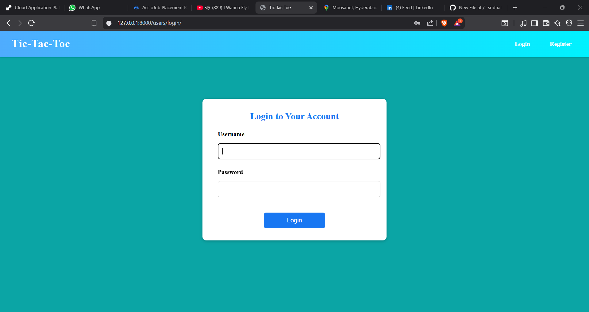
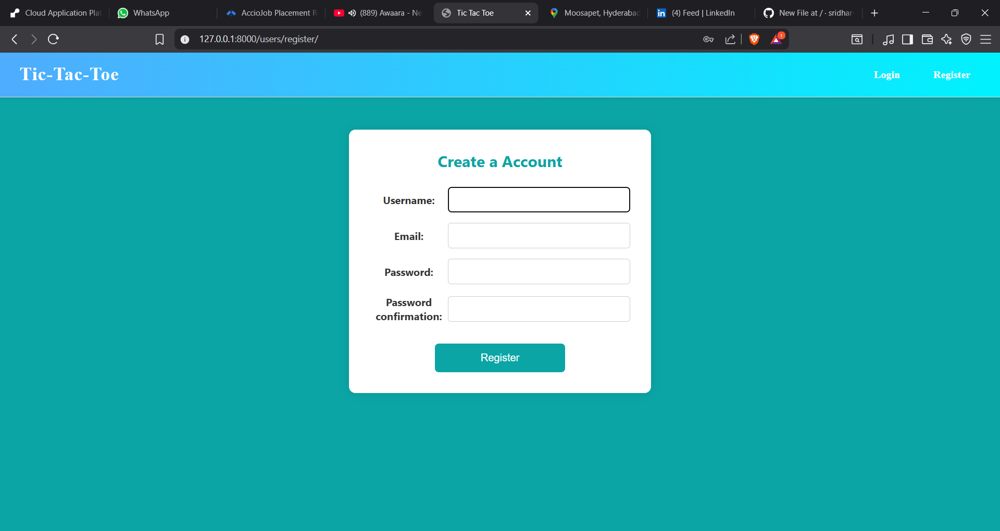
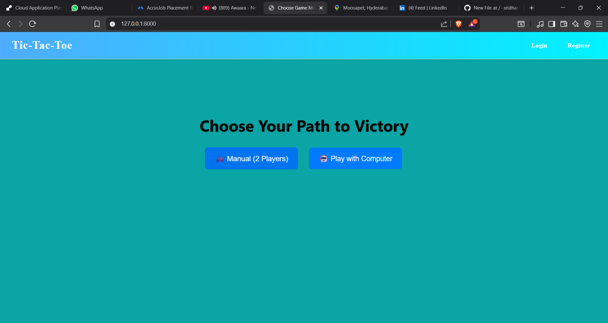
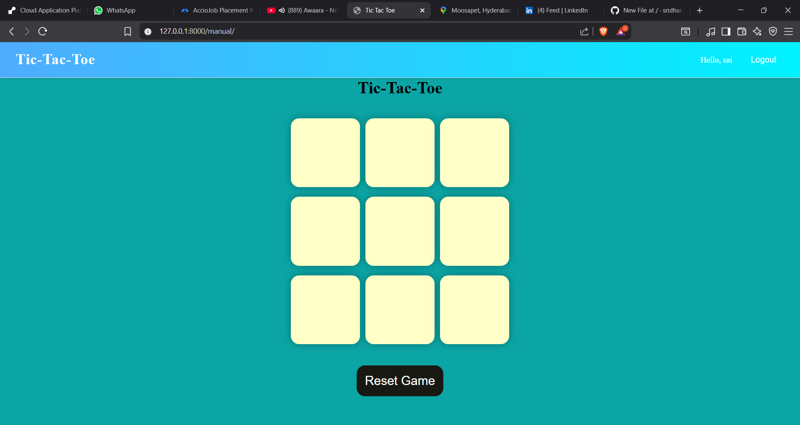
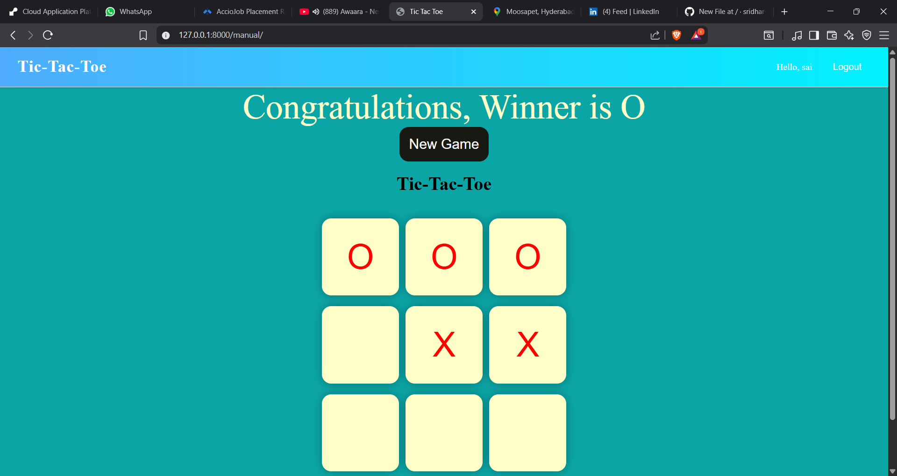
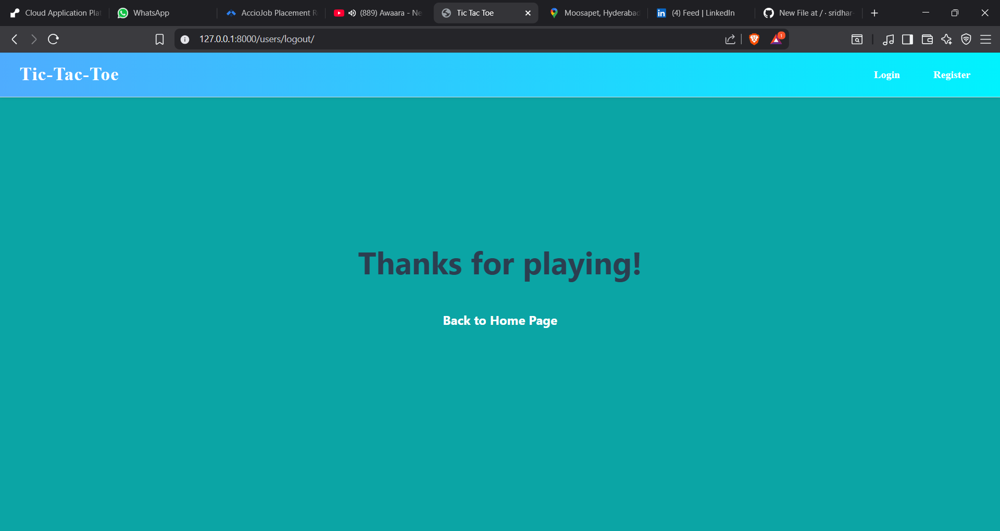

[### 🎮 Tic Tac Toe Web Application](https://sridhar-tic-tac-toe-web-application.onrender.com/)

This is a simple web-based Tic Tac Toe game built using **Django**, where two players can play the classic game in a web browser.


A simple and interactive Tic Tac Toe game built with [Your Tech Stack, e.g., HTML/CSS/JavaScript or React].  
🟢 **Live Demo:** [Click here to play](https://sridhar-tic-tac-toe-web-application.onrender.com/)

---

## 🚀 How It Works

- The user opens the game in a browser.
- You can choose game modes (e.g., Player vs Player).
- The game board appears with 3x3 grid.
- Players take turns marking a cell with "X" and "O".
- The game automatically detects a winner or a draw.
- After the game ends, the user can start a new game.

---

## 🛠️ Technologies Used

| Technology | Description |
|------------|-------------|
| **Python** | Programming language used for backend logic |
| **Django** | Web framework used to create and manage the app |
| **HTML5**  | For creating the structure of the web pages |
| **CSS3**   | For styling the UI (login form, board layout, etc.) |
| **Bootstrap** *(optional)* | For responsive design and layout |
| **SQLite3** | Default database used by Django for storing session data |

---

## 🧩 Features

- Login and Register page
- Player vs Player mode
- Game restart option
- Win/Draw detection
- Beautiful UI (Facebook-style login page layout)

---

## 🖥️ How to Run Locally

1. **Clone the repository**
   ```bash
   git clone https://github.com/your-username/your-repo.git
   cd your-repo


## 🎯 Screenshots
### Login page


### Register Page



### Home Page



### 🟢 Game Start



### 🏁 Game End



### LogOut page



### # 🎮 Tic Tac Toe Game

A simple and interactive Tic Tac Toe game built with [Your Tech Stack, e.g., HTML/CSS/JavaScript or React].  
🟢 **Live Demo:** [Click here to play](https://sridhar-tic-tac-toe-web-application.onrender.com/)


